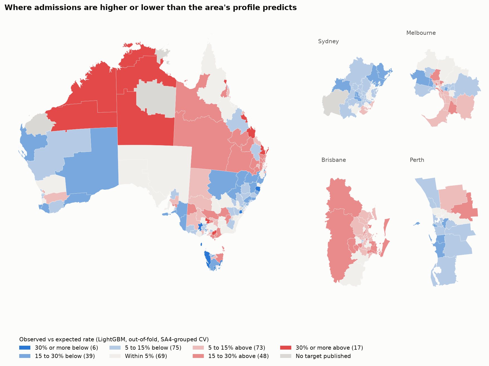

# Data Analytics Portfolio

[](https://github.com/Akash001uts/Data-Analytics-Portfolio/actions/workflows/ci.yml)

I'm a uni student studying data analytics, and this is where I keep my data projects. The first version of this
repo had three projects I made while I was learning: customer segmentation, sentiment analysis and an LSTM stock
forecast. Looking back at them, they mostly followed well-known tutorials, they didn't report proper metrics, and a
couple of them had real bugs. So I rebuilt it around projects where I ask my own question, use real open data, and
check my work properly. The old version is still at the [`v1-coursework`](https://github.com/Akash001uts/Data-Analytics-Portfolio/tree/v1-coursework)
tag if you want to see where I started.

| Project | The question | Status |
| --- | --- | --- |
| [Avoidable hospital admissions](projects/avoidable-hospitalisations) | Which parts of Australia have more potentially preventable hospital admissions than you'd expect from their social and access profile? | Done, with an [interactive map](https://akash001uts.github.io/Data-Analytics-Portfolio/) |
| [Sentiment analysis, redone](projects/sentiment-analysis) | When you measure it properly, how much better is a transformer than simple baselines at reading food reviews? | Done |

## Quick start

```
git clone https://github.com/Akash001uts/Data-Analytics-Portfolio.git
cd Data-Analytics-Portfolio
uv sync
uv run pytest
```

You need [uv](https://docs.astral.sh/uv/), which installs Python and all the packages for you. The tests run on
small made-up data, so they work straight away. To run the projects on the real data, see
[Running it step by step](#running-it-step-by-step) below, or open the repo in a Codespace and skip the setup:

[](https://codespaces.new/Akash001uts/Data-Analytics-Portfolio)

## Avoidable hospital admissions

Some hospital admissions are for things good care outside hospital can often prevent, like diabetes complications
or a COPD flare-up. The rate varies a lot across Australia, but most of that is expected: older, poorer and more
remote areas have more admissions. I wanted to find the areas that are still higher or lower than their profile
predicts, because those are the places where something else is going on.



**Why it's interesting:** neighbouring areas have very similar rates, so a normal random train/test split lets a
model peek at the answer through the neighbours. I tested every model twice, once with random folds and once
holding out whole regions, and the gap between the two was the most useful thing I found. A spatial lag model that
looked great when fitted on everything turned out to rely mostly on knowing its neighbours' rates.

What I found:

- A simple baseline (state and remoteness) gets a fair way. LightGBM does best, but by less than I expected.
- Maryborough in Queensland is the biggest surprise, at roughly double what its profile predicts, and it's been
  high in every year of the data.
- The leftover errors lean by state, even though the features don't include it. Giving LightGBM a state intercept
  lifts it further, but the NT and ACT still sit above expected.

The full write-up, with the results table, is in the [project README](projects/avoidable-hospitalisations).
There's also an [interactive version of the map](https://akash001uts.github.io/Data-Analytics-Portfolio/) you
can open in any browser. `uv run dap health report` rebuilds it.

## Sentiment analysis, redone

My first sentiment project said a RoBERTa transformer was "clearly" better than VADER without calculating a
single score. This time I measured it: seven models on the same 10,000 held-out Amazon food reviews, with macro-F1
and paired bootstrap intervals, after removing duplicate reviews and splitting by reviewer.


**Why it's interesting:** my old claim turned out to be right, but only half the story. RoBERTa does beat VADER,
and the interval for the difference is well clear of zero. But a plain TF-IDF and logistic regression model trained
on the reviews beats RoBERTa, which was trained on tweets and used as is. Tuning or recalibrating RoBERTa's
scores on validation barely helps, because its sense of "neutral" doesn't match a three-star rating. Fine-tuning a
small transformer on the reviews closes most of that gap, which says the training data mattered more than the
model. Accuracy would have told the wrong story too, because nearly four in five reviews are positive.

The full write-up is in the [project README](projects/sentiment-analysis).

## What I've learnt

I keep a running log in [LEARNINGS.md](LEARNINGS.md). The short version:

- **Check what the data actually counts before you pick it.** The most detailed hospital data I found only covers
  public hospitals, and that gap lines up with private health insurance. If I'd used it, my main map would have partly
  been a map of who has private cover.
- **Pin your data.** One of my sources published a new release while I was working on it. Because every file is
  checked against a fingerprint (a SHA256 hash), the download stopped and told me, instead of quietly changing my results.
- **Write the "don't cheat" rules as tests.** The easiest way to get a great-looking model is to accidentally feed it
  the answer. Here, the list of allowed inputs is in code, and tests fail if anything hospital-related sneaks in.
- **Look at the rows, not just the headers.** The spreadsheets had fake "areas" mixed in with the real ones, which I
  only found when I made a test count the rows.
- **Neighbours give the answer away.** Areas next to each other have very similar rates, so a random train/test
  split made every model look better than it is. Holding out whole regions at a time gave more honest scores.
- **Measure the claim you're making.** Measured properly, RoBERTa is better than VADER, but a plain TF-IDF model
  trained on the reviews beats them both.

## Running it step by step

Everything here runs on a normal laptop, with no GPU and no accounts to sign up for. All the data is public.

1. **Install uv.** On Windows (PowerShell):

   ```
   powershell -ExecutionPolicy ByPass -c "irm https://astral.sh/uv/install.ps1 | iex"
   ```

   On macOS or Linux:

   ```
   curl -LsSf https://astral.sh/uv/install.sh | sh
   ```

   (If you'd rather use pip, `pip install uv` works too. Just make sure the folder it installs into is on your PATH.)

2. **Get the code.**

   ```
   git clone https://github.com/Akash001uts/Data-Analytics-Portfolio.git
   cd Data-Analytics-Portfolio
   uv sync
   ```

   `uv sync` downloads Python 3.12 if you don't have it and installs the exact package versions in `uv.lock`.

3. **Run the tests.**

   ```
   uv run pytest
   ```

   These run on small made-up data in `tests/fixtures`, so they take a few seconds. They check that the data
   manifest is complete, that downloads get verified, and that nothing leaks the answer into a model: the feature
   allowlist blocks anything hospital-related, no SA4 ends up in both training and test folds, scalers only see
   training rows, and changing the test areas' rates doesn't change any prediction. For the sentiment project they
   check that duplicate reviews are removed before splitting and that no reviewer or review text crosses splits. A
   few tests say "skipped" because they need the real data, which comes next.

4. **Download the health data.**

   ```
   uv run dap health fetch
   ```

   This downloads about 210 MB from the AIHW, ABS and PHIDU websites into `data/raw/` and checks every file against
   `data/manifest.yaml`. Run `uv run pytest` again afterwards and the skipped tests will run too. They check every
   feature I use against the real spreadsheets.

5. **Build the cleaned table.**

   ```
   uv run dap health build
   ```

   This cleans and joins everything into one table with a row per SA3 (`data/processed/health_sa3.gpkg`) and writes a
   small summary to `reports/data_summary.json`. It takes about a minute.

6. **Fit the models.**

   ```
   uv run dap health train
   ```

   This runs the spatial statistics and every model under both kinds of cross-validation (about 3 minutes), then
   writes `reports/results.json`, the figures in `reports/figures/02_*.png`, and the results table in the project
   README. The per-area predictions go to `data/processed/health_sa3_results.gpkg`.

7. **Make the interactive map.**

   ```
   uv run dap health report
   ```

   This writes `reports/map/index.html`, a single page you can open in any browser. It shows each area compared
   with its expected rate, the admission rate itself, and the hot and cold spots, with a zoom button for each
   capital city.

8. **The sentiment project.**

   ```
   uv run dap sentiment fetch
   uv run dap sentiment train
   ```

   The first downloads about 120 MB of reviews from SNAP. The second removes duplicates, splits by reviewer, fits
   VADER and TF-IDF, and scores every model on the same 10,000 reviews (about 5 minutes). RoBERTa's predictions
   come from a committed cache, so you don't need PyTorch. To re-run RoBERTa itself: `uv sync --group nlp`, then
   `uv run dap sentiment transformer` (about 25 minutes on a laptop CPU). The fine-tuned DistilRoBERTa is cached
   the same way; `uv run dap sentiment finetune` redoes it (about 50 minutes).

9. **Open the notebooks.** They're already run, so you can read them on GitHub. To run them yourself:

   ```
   uv sync --group notebooks
   uv run jupyter lab projects
   ```

   The health notebooks are in `projects/avoidable-hospitalisations/notebooks` and the sentiment one is in
   `projects/sentiment-analysis/notebooks`.

### If something goes wrong

- **`upstream changed: ...`** means a publisher has updated a file since I last checked it, so it no longer matches
  its fingerprint. Nothing is wrong with your setup. The file that failed gets kept as `*.mismatch` in `data/raw/` so
  you can look at it. Feel free to [open an issue](https://github.com/Akash001uts/Data-Analytics-Portfolio/issues)
  and I'll re-check the source.
- **`uv` not found** after a pip install usually means pip's scripts folder isn't on your PATH. The official installer
  in step 1 avoids this.
- **Downloads are slow or blocked:** the files come from government websites, so a work or uni network that blocks
  large downloads can get in the way. Try another network, or download a single source with
  `uv run dap health fetch --only aihw_pph_sa3`.

## How the repo is laid out

```
projects/
  avoidable-hospitalisations/   the write-up, notebooks, and data.md (every source and check)
  sentiment-analysis/           the write-up and its notebook
src/dap/                        the shared Python code, so tests and notebooks can import it
  common/                       file paths, seeds, and the data manifest checker
  health/                       downloading, cleaning, the feature allowlist, spatial stats, models and CV
  sentiment/                    parsing and deduping the reviews, VADER, TF-IDF, the two transformers, evaluation
tests/                          pytest tests, plus tiny made-up data in tests/fixtures
data/manifest.yaml              where every health data file comes from, with its size and SHA256 (the data itself isn't in git)
data/sentiment_manifest.yaml    the same for the review data
reports/                        generated outputs: results.json, figures, the interactive map, the transformer caches
LEARNINGS.md                    what I've learnt and got wrong along the way
```

## Notes

Every number in the project READMEs' results tables is written by the code from `results.json`, not typed in by
hand, and a test fails if they drift apart. There are probably still rough edges, so if something breaks or you
spot a mistake, feel free to [open an issue](https://github.com/Akash001uts/Data-Analytics-Portfolio/issues).

This is a personal student project and isn't affiliated with or endorsed by any of the data publishers.

## Data and credits

The health data comes from the Australian Institute of Health and Welfare (AIHW), including its MyHospitals API, the
Australian Bureau of Statistics (ABS) and the Public Health Information Development Unit (PHIDU) at Torrens University
Australia. Every source, its edition and its licence is listed in
[the project's data notes](projects/avoidable-hospitalisations/data.md) and in `data/manifest.yaml`.

Based on Public Health Information Development Unit (PHIDU), Torrens University Australia material from: Social Health
Atlas of Australia: Population Health Areas (online) 2026. AIHW and ABS material is used under CC BY 4.0, and
MyHospitals data under CC BY 3.0 (as its API states).

The review data is the Amazon Fine Food Reviews dataset from the Stanford Network Analysis Project (SNAP):
J. McAuley and J. Leskovec, "From amateurs to connoisseurs: modeling the evolution of user expertise through online
reviews", WWW 2013. The transformer is CardiffNLP's
[`twitter-roberta-base-sentiment-latest`](https://huggingface.co/cardiffnlp/twitter-roberta-base-sentiment-latest)
(CC BY 4.0), and the one I fine-tuned is
[`distilroberta-base`](https://huggingface.co/distilbert/distilroberta-base) (Apache 2.0), both pinned to one commit.

## Licence

The code is MIT licensed. Anything derived from PHIDU data (tables, figures, maps and results) is shared under
CC BY-NC-SA 3.0 AU, as PHIDU's licence requires, so it's for non-commercial use.

The sentiment notebook quotes a few short review excerpts from the SNAP dataset. SNAP doesn't state a licence for it,
so those excerpts aren't covered by the MIT licence. They're only there to show where the models go wrong, and the
dataset is cited above. The committed RoBERTa predictions (review IDs and probabilities, no text) come from a CC BY
4.0 model, and the fine-tuned model's predictions from an Apache 2.0 one.
