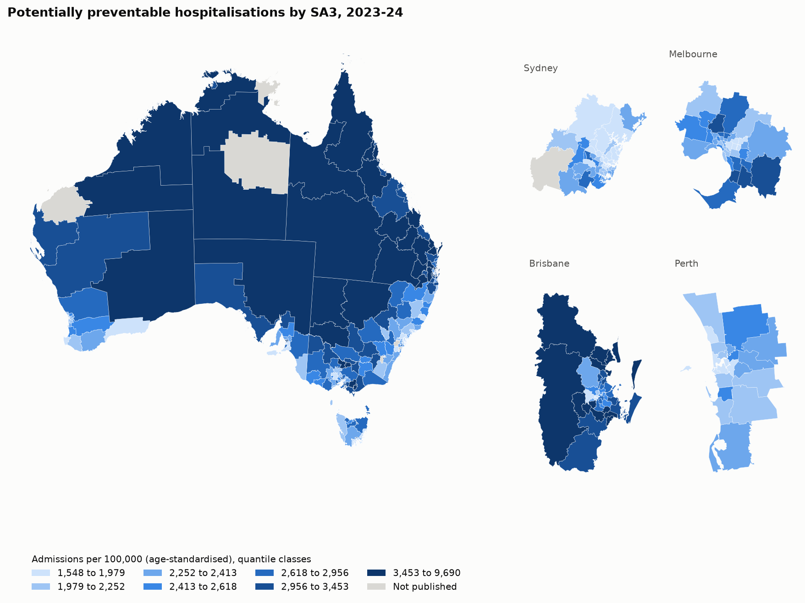

# Avoidable hospital admissions across Australia

Some hospital admissions are for conditions that good, timely care outside hospital can often prevent, like
complications of diabetes, COPD flare-ups, dental infections, or pneumonia that a vaccine could have stopped. The
AIHW calls these **potentially preventable hospitalisations** (PPH) and tracks them as a sign of how well primary care
is working.

Rates vary a lot between areas, but a lot of that is expected. Older, poorer or more remote areas tend to have more
admissions. What I find more interesting is the leftover part: once you account for an area's social, demographic
and access profile, which areas still have more (or fewer) admissions than you'd predict? Those are the places where
something else is going on, good or bad.

**Status:** data cleaned and explored, modelling next. Results will go here once the models are built, and the
numbers in this README will be generated from `reports/results.json`, not typed in by hand.

## The question

Which areas of Australia have more potentially preventable hospitalisations than their social, demographic and
access profile predicts, and what drives the differences?

## Data

All of it is open data. The full list, with editions, licences and every check I ran, is in [data.md](data.md).

| What | Where it's from | Used for |
| --- | --- | --- |
| PPH rates by area, 2017-18 to 2023-24, public and private hospitals | AIHW | What I'm predicting |
| About 30 area indicators (disadvantage, income support, housing, age, birthplace, screening, immunisation) | PHIDU Social Health Atlas | Model inputs |
| GP visits per person by area | AIHW (Medicare data) | Model inputs |
| Area boundaries, remoteness, socio-economic indexes | ABS | Maps, remoteness inputs, checks |
| Hospital locations | AIHW MyHospitals API | Distance to the nearest hospital |

The unit of analysis is the **SA3**, an ABS area of roughly 30,000 to 130,000 people. There are about 340 of them.

## How I'm approaching it

- [x] **Find and check the data.** Download every candidate source, compare them, choose the area level, and decide
  which columns the model is allowed to use. ([data.md](data.md))
- [x] **Set up the project properly.** A Python package, a `dap` command line tool, a manifest that checks every
  download, and tests for the leakage rules. ([LEARNINGS.md](../../LEARNINGS.md) has the details.)
- [x] **Clean and join everything into one table per area, then explore it** with maps, and rates by remoteness and
  disadvantage. ([notebook 01](notebooks/01_explore_the_data.ipynb))
- [ ] **Check whether neighbouring areas look alike** (spatial autocorrelation: Moran's I and hot spot maps). If they
  do, an ordinary random train/test split will flatter the model.
- [ ] **Build models from simple to complex:** a national average, then averages by state and remoteness, then
  linear regression, a spatial regression and LightGBM. Each one has to beat the simpler ones to be worth it.
- [ ] **Validate with spatial cross-validation.** Whole regions (SA4s) are held out together, and I'll compare that
  with a random split to show how much neighbouring areas inflate the score.
- [ ] **Map the residuals**, the "better or worse than expected" map, which is the main result.
- [ ] **Write it up**, including an interactive map.

## What I've found so far

### From exploring the data ([notebook 01](notebooks/01_explore_the_data.ipynb))

- **Remoteness and disadvantage both line up with higher rates,** and they overlap a lot. The rate climbs at every
  step away from the major cities, and remote areas are in a league of their own, with the biggest spread too.
- **Nearly every strong relationship is some version of "this area is poorer".** Welfare dependence, unemployment
  benefits, Health Care Cards, single-parent families, the IRSD and private health insurance all point the same way,
  and they're so closely related to each other that a model can't really tell them apart.
- **GP use barely relates to the rate,** which surprised me, since PPH is meant to reflect primary care. I checked
  whether it was just an age effect (the GP figures aren't age-standardised) and it isn't: it stays near zero after
  allowing for age or disadvantage. I don't know why yet. The models should help untangle it.
- **Fairfield in Sydney stands out.** It's one of the most disadvantaged areas in the country, but its rate is below
  the national median. More than half its residents were born in non-English-speaking countries, which fits what
  researchers call the "healthy migrant effect". I'll see whether the residual map picks it out.
- **COVID shifted the level, not the pattern.** Rates dipped nationally, but the ranking of areas before and after is
  very similar, so using 2023-24 is safe.
- **The rate is very skewed,** with a few remote areas far above the rest, so I'll model the log of the rate.

### From checking the sources ([data.md](data.md))

- **The most detailed data was the wrong choice.** PHIDU publishes PPH for about 1,165 small areas, which is much
  more detail than the AIHW's 340 SA3s. But it only counts public hospitals, and it only covers 2020-21, the middle of
  COVID. When I compared the two at SA3 level, the public-only rate fell well short of the all-hospital rate in areas
  with lots of private health insurance. A model built on the public-only numbers would partly be learning who has
  private cover. I went with the SA3 data instead, which counts public and private hospitals and goes up to 2023-24.
- **COVID shows up clearly.** National PPH rates dropped in 2020-21 and have mostly recovered since. Vaccine-preventable
  admissions (mostly pneumonia and flu) fell the furthest, which makes sense with lockdowns and masks. I'm using
  2023-24 as the main year and 2018-19 as a pre-COVID check.
- **The data I'd planned on for GP use doesn't exist at the small-area level.** I'd assumed the Social Health Atlas had
  GP visit rates, but the current release doesn't. The AIHW's Medicare tables have them by SA3, which was another
  reason to go with SA3.
- **The areas nest neatly.** Every small area sits inside exactly one SA3, and every SA3 inside one SA4. That matters,
  because the spatial cross-validation holds out whole SA4s at a time.
- **Some of the most remote areas have no published rate.** The AIHW suppresses rates for areas with very small numbers.
  Most of those are near-empty areas, but a few are remote Northern Territory and Pilbara regions that probably have
  some of the highest rates in the country. The model never sees them, so it will be weakest exactly where need is
  highest. I'll keep coming back to that in the write-up.

## Limitations I already know about

- This is area-level data, so it describes places, not people. An area with high admissions doesn't mean any
  particular person there had a worse experience.
- The inputs come from a few different years (mostly the 2021 Census, some from 2025) and the outcome is 2023-24.
- The "distance to emergency department" input only counts hospitals in the national ED collection, which misses many
  small rural hospitals. I'm also using distance to any public hospital to make up for that.
- PPH counts hospital stays, not people, so one person admitted three times counts three times.

## Run it

See [Reproduce it yourself](../../README.md#reproduce-it-yourself) in the main README.
