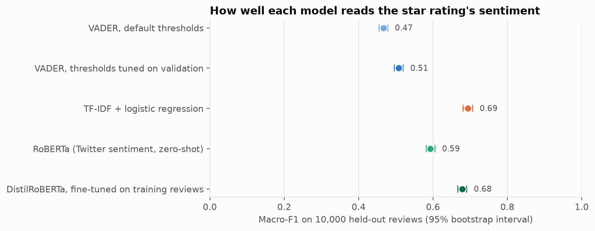

# Sentiment analysis, redone

My first sentiment project compared VADER (a rule-based scorer) with a RoBERTa transformer on Amazon Fine Food Reviews,
and concluded that RoBERTa was clearly better. Looking back, I never actually measured that. I plotted each model's
scores against the star ratings and looked at a few example reviews, but I never calculated an accuracy or F1
score. I also only used 500 reviews, dropped any review that was too long instead of truncating it, and used a model
trained on tweets for food reviews. So this time I wanted to answer the question properly.

Every number in the results table below is written by `dap sentiment train` from `reports/sentiment/results.json`,
not typed in by hand, and a test fails if they drift apart.

## The question

When you measure it properly, how much better is a transformer than simple baselines at reading the sentiment of food
reviews, and where do they all go wrong?

## How I did it

- **Data:** the full Amazon Fine Food Reviews dataset from SNAP (568,454 reviews), downloaded by `dap sentiment fetch`
  and checked against a SHA256 hash. No review text is committed to this repo, apart from a few short excerpts in
  the notebook.
- **Labels:** 1 to 2 stars negative, 3 neutral, 4 to 5 positive. I use the review text only, not the summary line,
  because the summary is often a verdict in itself ("Good Quality Dog Food").
- **Duplicates removed before splitting.** The same review shows up under every variant of a product, so I removed
  repeats of the same reviewer and text, then texts shared by different reviewers (dropping both copies when their
  stars disagreed).
- **Split by reviewer,** 70% train, 10% validation and 20% test, so nobody's reviews are on both sides. A word-based
  model could otherwise recognise a prolific reviewer's style. Tests check that no reviewer and no review text ends
  up in two splits.
- **One fixed evaluation sample** of 10,000 test reviews, stratified by label. Every model is scored on exactly these.
- **Models:**
  - VADER with its default thresholds, which is what my first version used;
  - VADER with thresholds tuned on the validation reviewers, so it isn't an unfair strawman;
  - TF-IDF (words and word pairs) with logistic regression, trained on the training reviewers, with its settings
    picked on validation;
  - the Twitter-trained RoBERTa sentiment model, used as is, with long reviews truncated to 512 tokens instead of
    dropped. Its predictions are cached in `reports/sentiment/roberta_predictions.csv` (review ids and probabilities
    only), so nothing else needs a GPU or even PyTorch;
  - DistilRoBERTa (a smaller RoBERTa) fine-tuned on the training reviewers. My laptop has no GPU, so I kept it
    small: 20,000 training reviews with the same label mix as the full split, each cut to its first 128 tokens,
    one pass over the data, and the checkpoint picked on 2,000 validation reviews. Its predictions are cached the
    same way, in `reports/sentiment/finetuned_predictions.csv`.
- **Evaluation:** macro-F1, so the small neutral class counts as much as the others, with paired bootstrap
  intervals. "Paired" means every model is scored on the same resampled reviews, so I can put an interval on the
  *difference* between two models, which is the thing my first version claimed without measuring.

## Results ([notebook 01](notebooks/01_evaluate_sentiment.ipynb))

<!-- results:start (generated by `dap sentiment train` from reports/sentiment/results.json) -->

**Data:** 568,454 reviews; 393,115 after removing duplicates; split by reviewer into 274,592 training, 40,235 validation and 78,288 test reviews. Every model is scored on the same 10,000 test reviews (78% positive, 14% negative, 8% neutral). Intervals are 95% paired bootstrap intervals (2,000 resamples).

| Model | Macro-F1 (95% interval) | Accuracy | Neutral recall | Negative recall |
| --- | --- | ---: | ---: | ---: |
| VADER, default thresholds | 0.467 (0.456 to 0.478) | 0.797 | 0.04 | 0.38 |
| VADER, thresholds tuned on validation | 0.508 (0.496 to 0.520) | 0.750 | 0.24 | 0.41 |
| TF-IDF + logistic regression | 0.694 (0.681 to 0.706) | 0.851 | 0.52 | 0.78 |
| RoBERTa (Twitter sentiment, zero-shot) | 0.593 (0.582 to 0.605) | 0.815 | 0.20 | 0.75 |
| DistilRoBERTa, fine-tuned on training reviews | 0.679 (0.666 to 0.691) | 0.838 | 0.50 | 0.79 |

Differences in macro-F1 (same reviews, paired bootstrap):

- RoBERTa (Twitter sentiment, zero-shot) minus VADER, default thresholds: 0.126 (0.112 to 0.142)
- TF-IDF + logistic regression minus RoBERTa (Twitter sentiment, zero-shot): 0.101 (0.085 to 0.116)
- VADER, thresholds tuned on validation minus VADER, default thresholds: 0.041 (0.029 to 0.053)
- DistilRoBERTa, fine-tuned on training reviews minus RoBERTa (Twitter sentiment, zero-shot): 0.085 (0.070 to 0.100)
- DistilRoBERTa, fine-tuned on training reviews minus TF-IDF + logistic regression: -0.016 (-0.028 to -0.003)

<!-- results:end -->



## What I found

- My original claim holds up, once it's measured. RoBERTa beats VADER, with or without tuning VADER's
  thresholds, and the interval for the difference sits well clear of zero.
- But a simple model trained on these reviews beats it. TF-IDF with logistic regression, trained on food
  reviews, beats the Twitter-trained RoBERTa used as is. That's a model trained on the right text against a bigger
  model trained on different text.
- Fine-tuning closes most of that gap, but not all of it. A small transformer fine-tuned on 20,000 of the
  training reviews beats zero-shot RoBERTa comfortably and lands just below TF-IDF, and the interval for that
  last difference only just misses zero. On reviews short enough to fit in its 128 tokens it's at least as good
  as TF-IDF; on the longer ones, where it only sees the start, it falls well behind. So most of RoBERTa's gap was
  the training data, and what's left looks like what I cut to make it run on a CPU.
- Accuracy would have told the wrong story. Nearly four in five reviews are positive, so tuning VADER's
  thresholds lowers its accuracy while raising its macro-F1, because it starts finding some neutral reviews.
- VADER's default thresholds call most negative reviews positive. It adds up word scores, so "good" in "a good
  chunk of cash for nothing" and "like" in "tastes like it's way past its expiration date" push a one-star review
  towards positive.
- Neutral is the hard class, and partly a label problem. Three-star reviews are mostly mild complaints or mixed
  feelings, while the Twitter model's "neutral" means "no sentiment". Some one-star reviews praise the food and
  complain about the price, and at least one reads like a five-star review with the wrong rating.
- RoBERTa gets worse as reviews get longer; TF-IDF doesn't. Very few reviews hit RoBERTa's 512-token limit, so
  truncation isn't the main reason.
- I checked whether TF-IDF was cheating by reading ratings written in the text ("three stars"). Those phrases
  are among its strongest clues, but only a small share of reviews contain them, and its score is about the same
  without them.

## Limitations

- The labels come from star ratings, which mix sentiment with price, delivery and the odd mistake.
- RoBERTa is used zero-shot, and unlike VADER's thresholds, its decision rule wasn't tuned on validation. Most of
  its gap is on the neutral class, which tuning might move.
- The fine-tuned model saw 20,000 reviews cut to 128 tokens, while TF-IDF learnt from all of the training reviews
  in full. That's not an even contest, and with one run I can't say whether more data or longer inputs would
  matter more.
- One dataset and one kind of text: Amazon food reviews from 1999 to 2012.

## Run it

```
uv run dap sentiment fetch     # about 120 MB from SNAP
uv run dap sentiment train     # VADER, TF-IDF, and scoring everything (uses the cached RoBERTa predictions)
```

To re-run RoBERTa itself (about 25 minutes on a laptop CPU): `uv sync --group nlp`, then
`uv run dap sentiment transformer`. To redo the fine-tuning (about 50 minutes on a laptop CPU), run
`uv run dap sentiment finetune` after the same `uv sync`. The fine-tuned weights stay in `data/processed`.

## Credits and licence

The data is from J. McAuley and J. Leskovec, "From amateurs to connoisseurs: modeling the evolution of user
expertise through online reviews", WWW 2013, via SNAP. SNAP doesn't state a licence for this dataset, so the few
review excerpts in the notebook aren't covered by this repo's licence. The models are
`cardiffnlp/twitter-roberta-base-sentiment-latest` (CC BY 4.0) and `distilbert/distilroberta-base` (Apache 2.0),
each pinned to one commit. My code is MIT licensed.
